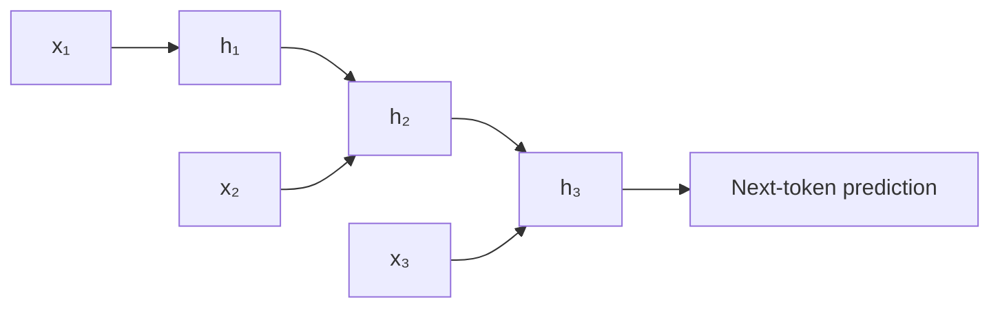
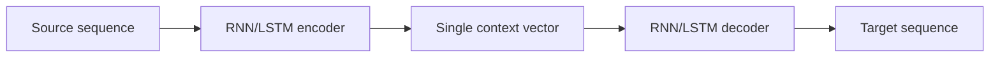
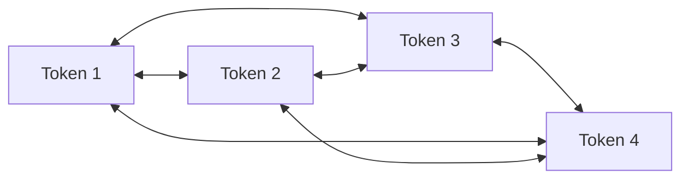
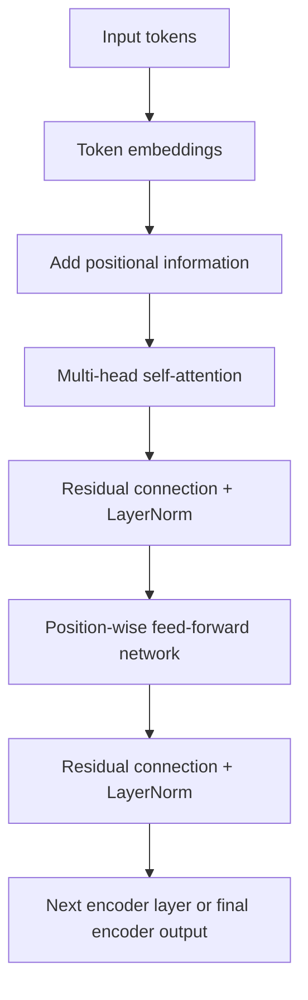
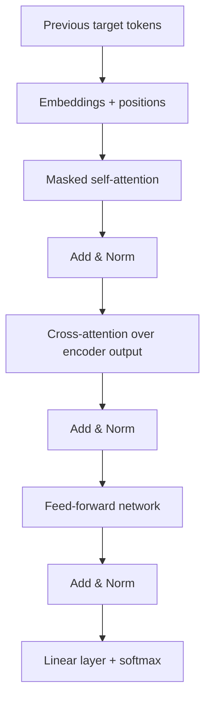

# Attention and Transformers for Beginners

A practical, math-first introduction to the evolution of language models:

```text
n-grams → RNNs → LSTMs/GRUs → seq2seq → attention → Transformers
```

The goal is not only to memorize formulas. By the end, you should understand:

- why earlier language models struggled with long context;
- what Bahdanau and Luong attention added to recurrent seq2seq models;
- how queries, keys, and values work;
- how scaled dot-product self-attention is calculated;
- how the Transformer encoder and decoder are constructed;
- why residual connections, layer normalization, positional encoding, and feed-forward networks are necessary;
- why Transformers train more efficiently than recurrent models;
- what limitations standard Transformers still have.

The examples use small artificial vectors so that every calculation can be followed by hand.

---

## Table of contents

1. [The language-modeling problem](#1-the-language-modeling-problem)
2. [Statistical n-gram models](#2-statistical-n-gram-models)
3. [Recurrent neural networks](#3-recurrent-neural-networks)
4. [LSTM and GRU](#4-lstm-and-gru)
5. [The seq2seq bottleneck](#5-the-seq2seq-bottleneck)
6. [Bahdanau and Luong attention](#6-bahdanau-and-luong-attention)
7. [From recurrent attention to self-attention](#7-from-recurrent-attention-to-self-attention)
8. [Queries, keys, and values](#8-queries-keys-and-values)
9. [Scaled dot-product attention](#9-scaled-dot-product-attention)
10. [A complete numerical self-attention example](#10-a-complete-numerical-self-attention-example)
11. [Multi-head attention](#11-multi-head-attention)
12. [The Transformer encoder](#12-the-transformer-encoder)
13. [The Transformer decoder](#13-the-transformer-decoder)
14. [Training objective](#14-training-objective)
15. [Why Transformers are strong](#15-why-transformers-are-strong)
16. [Limitations](#16-limitations)
17. [NumPy implementation](#17-numpy-implementation)
18. [Practice exercises](#18-practice-exercises)
19. [Key takeaways](#19-key-takeaways)
20. [References](#20-references)

---

# 1. The language-modeling problem

A language model assigns a probability to a sequence of tokens:

\[
P(w_1,w_2,\ldots,w_T)
\]

Using the probability chain rule:

\[
P(w_1,w_2,\ldots,w_T)
=
\prod_{t=1}^{T}
P(w_t \mid w_1,\ldots,w_{t-1})
\]

For the sentence:

> I like Persian poetry

the probability is decomposed as:

\[
P(\text{I})
P(\text{like}\mid\text{I})
P(\text{Persian}\mid\text{I like})
P(\text{poetry}\mid\text{I like Persian})
\]

The central NLP problem is therefore:

> How should a model represent the previous context when predicting the next token?

Different generations of language models answer this question differently.

---

# 2. Statistical n-gram models

An n-gram model uses only a fixed number of previous tokens.

For a trigram model:

\[
P(w_t\mid w_1,\ldots,w_{t-1})
\approx
P(w_t\mid w_{t-2},w_{t-1})
\]

The probability can be estimated from corpus counts:

\[
P(w_t\mid w_{t-2},w_{t-1})
=
\frac{C(w_{t-2},w_{t-1},w_t)}
{C(w_{t-2},w_{t-1})}
\]

## Example

Suppose a corpus contains:

\[
C(\text{I like})=40
\]

and:

\[
C(\text{I like tea})=30
\]

Then:

\[
P(\text{tea}\mid\text{I like})
=
\frac{30}{40}
=
0.75
\]

So the trigram model assigns probability \(0.75\) to *tea* after *I like*.

## Main limitations

### 1. Fixed context

A trigram model sees only two previous tokens.

Consider:

> The book that I bought yesterday was expensive.

To predict *was*, the subject *book* is several tokens away. A trigram model cannot directly use that dependency.

### 2. Data sparsity

If an n-gram never appears in the training corpus, its raw count is zero.

For example:

\[
C(\text{I enjoy saffron tea})=0
\]

does not mean the phrase is impossible. It may simply be absent from the corpus.

Smoothing methods reduce this problem, but they do not eliminate the fixed-context limitation.

### 3. Weak semantic sharing

These sentences are semantically similar:

- I like tea.
- I enjoy coffee.

A symbolic n-gram model does not naturally understand that *like* and *enjoy* are related or that *tea* and *coffee* are related.

---

# 3. Recurrent neural networks

A recurrent neural network processes a sequence one token at a time.

At time step \(t\), it computes:

\[
h_t
=
\tanh(W_xx_t+W_hh_{t-1}+b_h)
\]

where:

- \(x_t\) is the current token representation;
- \(h_{t-1}\) is the previous hidden state;
- \(h_t\) is the new hidden state.

The next-token distribution is:

\[
P(w_{t+1}\mid w_{\leq t})
=
\operatorname{softmax}(W_oh_t+b_o)
\]

The hidden state is intended to summarize the sequence seen so far.



## A tiny scalar example

Assume a one-dimensional RNN:

\[
h_t=\tanh(x_t+0.5h_{t-1})
\]

Let:

\[
h_0=0
\]

and input values:

\[
x_1=1,\qquad x_2=0.5
\]

Then:

\[
h_1=\tanh(1+0.5(0))=\tanh(1)\approx0.762
\]

Next:

\[
h_2=\tanh(0.5+0.5(0.762))
\]

\[
h_2=\tanh(0.881)\approx0.707
\]

The second state contains information from both \(x_2\) and the previous state.

## Why ordinary RNNs struggle with long sequences

During backpropagation, gradients pass through many recurrent transitions:

\[
\frac{\partial h_t}{\partial h_{t-k}}
=
\prod_{j=t-k+1}^{t}
\frac{\partial h_j}{\partial h_{j-1}}
\]

Suppose each local derivative is approximately \(0.5\). After ten steps:

\[
0.5^{10}\approx0.00098
\]

The training signal becomes extremely small. This is the **vanishing-gradient problem**.

If the repeated derivative is larger than \(1\), the gradient may instead become extremely large. This is the **exploding-gradient problem**.

RNNs also remain sequential:

\[
h_1\rightarrow h_2\rightarrow h_3\rightarrow\cdots\rightarrow h_n
\]

The model cannot compute \(h_{10}\) before computing \(h_1,\ldots,h_9\).

---

# 4. LSTM and GRU

LSTM and GRU architectures introduce gates that control the flow of information.

## 4.1 LSTM

An LSTM has a hidden state \(h_t\) and a cell state \(c_t\).

### Forget gate

\[
f_t
=
\sigma(W_f[x_t;h_{t-1}]+b_f)
\]

The forget gate decides how much old memory to preserve.

### Input gate

\[
i_t
=
\sigma(W_i[x_t;h_{t-1}]+b_i)
\]

### Candidate memory

\[
\tilde c_t
=
\tanh(W_c[x_t;h_{t-1}]+b_c)
\]

### Cell-state update

\[
c_t
=
f_t\odot c_{t-1}
+
i_t\odot\tilde c_t
\]

### Output gate

\[
o_t
=
\sigma(W_o[x_t;h_{t-1}]+b_o)
\]

### Hidden state

\[
h_t=o_t\odot\tanh(c_t)
\]

Here, \(\odot\) means element-wise multiplication.

## Scalar LSTM example

Suppose:

\[
c_{t-1}=0.8
\]

\[
f_t=0.9,\qquad i_t=0.3,\qquad \tilde c_t=0.5
\]

Then:

\[
c_t
=
0.9(0.8)+0.3(0.5)
\]

\[
c_t=0.72+0.15=0.87
\]

If:

\[
o_t=0.7
\]

then:

\[
h_t
=
0.7\tanh(0.87)
\approx
0.7(0.701)
\approx
0.491
\]

The model preserves most of the old memory and adds a smaller amount of new information.

## 4.2 GRU

A GRU is a simpler gated recurrent model.

### Update gate

\[
z_t
=
\sigma(W_zx_t+U_zh_{t-1}+b_z)
\]

### Reset gate

\[
r_t
=
\sigma(W_rx_t+U_rh_{t-1}+b_r)
\]

### Candidate state

\[
\tilde h_t
=
\tanh(W_hx_t+U_h(r_t\odot h_{t-1})+b_h)
\]

### Final state

One common convention is:

\[
h_t
=
(1-z_t)\odot h_{t-1}
+
z_t\odot\tilde h_t
\]

## Scalar GRU example

Suppose:

\[
h_{t-1}=0.6,\qquad
z_t=0.25,\qquad
\tilde h_t=0.2
\]

Then:

\[
h_t
=
0.75(0.6)+0.25(0.2)
\]

\[
h_t=0.45+0.05=0.50
\]

The result remains mostly based on the old state.

## What LSTMs and GRUs solved

They improved:

- gradient flow;
- long-term memory;
- control over forgetting and updating.

## What they did not solve

They still process tokens sequentially:

\[
h_1\rightarrow h_2\rightarrow\cdots\rightarrow h_n
\]

Long-distance information still passes through many recurrent steps.

---

# 5. The seq2seq bottleneck

Early neural machine translation systems used an encoder-decoder architecture.



The encoder reads:

\[
x_1,x_2,\ldots,x_n
\]

and produces hidden states:

\[
h_1,h_2,\ldots,h_n
\]

A simple seq2seq model uses only the final state:

\[
c=h_n
\]

The decoder then generates:

\[
s_t=g(y_{t-1},s_{t-1},c)
\]

This forces the whole source sentence into one fixed-size vector \(c\).

## Why this is a bottleneck

Consider translating:

> The old book that Sara bought in Tehran last year was surprisingly expensive.

The final encoder state must preserve:

- the main subject;
- the relative clause;
- the place;
- the time;
- the adjective;
- the predicate.

As the sentence grows, important details may be compressed or forgotten.

Attention was introduced to avoid relying on only one fixed context vector.

---

# 6. Bahdanau and Luong attention

> Bahdanau and Luong are not alternatives to “attention.” They are early forms of neural attention used inside recurrent seq2seq models.

Instead of using:

\[
c=h_n
\]

the decoder constructs a different context vector for every output step:

\[
c_t=\sum_i\alpha_{t,i}h_i
\]

The decoder can therefore focus on different source words while generating different target words.

## 6.1 The general attention procedure

For each source position \(i\):

1. Compute a relevance score:

\[
e_{t,i}=\operatorname{score}(s,h_i)
\]

2. Normalize the scores:

\[
\alpha_{t,i}
=
\frac{\exp(e_{t,i})}
{\sum_j\exp(e_{t,j})}
\]

3. Compute the context vector:

\[
c_t
=
\sum_i\alpha_{t,i}h_i
\]

The weights satisfy:

\[
\alpha_{t,i}\geq0
\]

and:

\[
\sum_i\alpha_{t,i}=1
\]

## 6.2 Bahdanau attention

Bahdanau attention is often called **additive attention**:

\[
e_{t,i}
=
v_a^\top
\tanh(W_ss_{t-1}+W_hh_i+b_a)
\]

The decoder state and encoder state are projected, added, passed through \(\tanh\), and then reduced to a scalar score.

## 6.3 Luong attention

Luong attention proposed several scoring functions.

### Dot product

\[
e_{t,i}=s_t^\top h_i
\]

### General

\[
e_{t,i}=s_t^\top W_ah_i
\]

### Concatenation

\[
e_{t,i}
=
v_a^\top\tanh(W_a[s_t;h_i])
\]

Luong also distinguished:

- **global attention**, which scores all source positions;
- **local attention**, which focuses on a smaller predicted window.

## Translation example

Source:

> علی کتاب را خواند

Target:

> Ali read the book

An illustrative attention matrix might be:

| Target token | علی | کتاب | را | خواند |
|---|---:|---:|---:|---:|
| Ali | 0.82 | 0.05 | 0.03 | 0.10 |
| read | 0.08 | 0.10 | 0.04 | 0.78 |
| the | 0.05 | 0.35 | 0.50 | 0.10 |
| book | 0.04 | 0.76 | 0.15 | 0.05 |

These values are illustrative, but they show the idea:

- generating *Ali* focuses on **علی**;
- generating *read* focuses on **خواند**;
- generating *book* focuses on **کتاب**.

## What recurrent attention improved

It removed the single-vector bottleneck:

\[
c
\quad\longrightarrow\quad
c_1,c_2,\ldots,c_m
\]

It also created soft alignments between source and target words.

## What remained difficult

Bahdanau and Luong models still contained recurrent encoders and recurrent decoders.

The encoder still followed:

\[
h_1\rightarrow h_2\rightarrow\cdots\rightarrow h_n
\]

The decoder still followed:

\[
s_1\rightarrow s_2\rightarrow\cdots\rightarrow s_m
\]

Attention improved information access, but recurrence remained the computational backbone.

---

# 7. From recurrent attention to self-attention

Traditional seq2seq attention asks:

> Which encoder states should the decoder use now?

Self-attention asks a more general question:

> Which tokens in this sequence should each token use?

Consider:

> The animal did not cross the street because it was tired.

When building a contextual representation for *it*, self-attention can directly examine:

- *animal*;
- *street*;
- *tired*;
- all other tokens.

The model may assign high attention to *animal* because it is a plausible antecedent of *it*.

The Transformer makes self-attention the central operation and removes recurrent connections from its main architecture.



In one self-attention layer, every token can directly interact with every other token.

---

# 8. Queries, keys, and values

Attention uses three representations:

- **Query:** what information is this token looking for?
- **Key:** what information does another token advertise?
- **Value:** what information should be retrieved from that token?

A useful analogy is semantic search.

Suppose a token representing *it* asks:

> Which earlier token is a plausible antecedent?

That request is its query.

Each earlier token has a key describing how it can be matched. If *animal* has a key that matches strongly, its value contributes heavily to the new representation of *it*.

Given an input matrix:

\[
X\in\mathbb{R}^{n\times d_{\text{model}}}
\]

the model learns:

\[
Q=XW^Q
\]

\[
K=XW^K
\]

\[
V=XW^V
\]

where:

- \(Q\in\mathbb{R}^{n\times d_k}\);
- \(K\in\mathbb{R}^{n\times d_k}\);
- \(V\in\mathbb{R}^{n\times d_v}\).

The matrices \(W^Q,W^K,W^V\) are learned during training.

---

# 9. Scaled dot-product attention

The main Transformer attention formula is:

\[
\boxed{
\operatorname{Attention}(Q,K,V)
=
\operatorname{softmax}
\left(
\frac{QK^\top}{\sqrt{d_k}}
\right)V
}
\]

Let us unpack it.

## 9.1 Similarity scores

\[
QK^\top
\]

produces an \(n\times n\) matrix.

Entry \((i,j)\) is:

\[
q_i^\top k_j
\]

This measures how relevant token \(j\) is to token \(i\).

## 9.2 Scaling

The scores are divided by:

\[
\sqrt{d_k}
\]

Why?

If query and key components have variance close to \(1\), then:

\[
q^\top k
=
\sum_{\ell=1}^{d_k}q_\ell k_\ell
\]

tends to grow in magnitude as \(d_k\) grows.

Large scores can make softmax extremely sharp. One position may receive probability close to \(1\), while the rest receive values close to \(0\). That can produce weak gradients.

Dividing by \(\sqrt{d_k}\) keeps the score scale more stable.

## 9.3 Softmax

Softmax converts each row into a probability distribution:

\[
\alpha_{ij}
=
\frac{
\exp(s_{ij})
}{
\sum_m\exp(s_{im})
}
\]

where:

\[
s_{ij}
=
\frac{q_i^\top k_j}{\sqrt{d_k}}
\]

## 9.4 Weighted value combination

Finally:

\[
o_i=\sum_j\alpha_{ij}v_j
\]

Each token receives a weighted mixture of value vectors from all tokens.

---

# 10. A complete numerical self-attention example

Use three tokens:

\[
[\text{Ali},\text{book},\text{read}]
\]

For simplicity, assign artificial two-dimensional vectors:

\[
X=
\begin{bmatrix}
1&0\\
0&1\\
1&1
\end{bmatrix}
\]

Assume:

\[
W^Q=W^K=W^V=I
\]

Therefore:

\[
Q=K=V=X
\]

This identity-matrix assumption is only for demonstration. In a real Transformer, the projection matrices are learned.

## Step 1: compute \(QK^\top\)

\[
QK^\top
=
\begin{bmatrix}
1&0\\
0&1\\
1&1
\end{bmatrix}
\begin{bmatrix}
1&0&1\\
0&1&1
\end{bmatrix}
\]

\[
QK^\top
=
\begin{bmatrix}
1&0&1\\
0&1&1\\
1&1&2
\end{bmatrix}
\]

Interpretation:

- the first token has dot product \(1\) with itself;
- it has dot product \(0\) with the second token;
- it has dot product \(1\) with the third token.

## Step 2: divide by \(\sqrt{d_k}\)

Here:

\[
d_k=2
\]

so:

\[
\sqrt{d_k}=\sqrt{2}\approx1.414
\]

Therefore:

\[
S
=
\frac{QK^\top}{\sqrt{2}}
\approx
\begin{bmatrix}
0.707&0&0.707\\
0&0.707&0.707\\
0.707&0.707&1.414
\end{bmatrix}
\]

## Step 3: apply softmax row by row

\[
A=\operatorname{softmax}(S)
\]

Approximately:

\[
A=
\begin{bmatrix}
0.401&0.198&0.401\\
0.198&0.401&0.401\\
0.248&0.248&0.503
\end{bmatrix}
\]

Each row sums to \(1\).

The first row means that the first token retrieves:

- \(40.1\%\) from token 1;
- \(19.8\%\) from token 2;
- \(40.1\%\) from token 3.

## Step 4: multiply by \(V\)

\[
O=AV
\]

\[
O=
\begin{bmatrix}
0.401&0.198&0.401\\
0.198&0.401&0.401\\
0.248&0.248&0.503
\end{bmatrix}
\begin{bmatrix}
1&0\\
0&1\\
1&1
\end{bmatrix}
\]

The result is:

\[
O
\approx
\begin{bmatrix}
0.802&0.599\\
0.599&0.802\\
0.752&0.752
\end{bmatrix}
\]

The original first-token vector was:

\[
[1,0]
\]

Its contextualized vector becomes:

\[
[0.802,0.599]
\]

It now contains information retrieved from the other tokens.

> Self-attention does not merely decide which tokens are important. It constructs a new representation by mixing their value vectors.

---

# 11. Multi-head attention

A single attention operation produces one pattern of relationships.

Language contains many kinds of relationships:

- subject–verb;
- verb–object;
- pronoun–antecedent;
- adjective–noun;
- semantic similarity;
- positional relationships.

Multi-head attention computes several attention operations in parallel.

For head \(j\):

\[
\operatorname{head}_j
=
\operatorname{Attention}
(
XW_j^Q,
XW_j^K,
XW_j^V
)
\]

The heads are concatenated:

\[
H=
[
\operatorname{head}_1;
\operatorname{head}_2;
\ldots;
\operatorname{head}_h
]
\]

Then projected:

\[
\operatorname{MultiHead}(X)=HW^O
\]

## Shape example

Suppose:

\[
d_{\text{model}}=512
\]

and:

\[
h=8
\]

A common arrangement is:

\[
d_k=d_v=64
\]

because:

\[
8\times64=512
\]

Each head works in its own learned subspace.

One head may become useful for local syntactic relations, while another may help with long-distance dependencies. However, individual heads are not guaranteed to have a clean human-interpretable function.

---

# 12. The Transformer encoder

The original Transformer encoder contains repeated layers.



A simplified encoder layer is:

\[
\text{Self-attention}
\rightarrow
\text{Add \& Norm}
\rightarrow
\text{Feed-forward}
\rightarrow
\text{Add \& Norm}
\]

## 12.1 Token embeddings

Each token ID indexes a learned embedding matrix:

\[
E\in\mathbb{R}^{|V|\times d_{\text{model}}}
\]

If token \(t_i\) has vocabulary ID \(k\), then:

\[
x_i=E_k
\]

For example:

\[
E_{\text{book}}
=
[0.2,-0.1,0.7,0.4]
\]

Embeddings represent lexical information, but they do not inherently represent token order.

## 12.2 Positional encoding

Without positional information, self-attention would treat these token sets similarly:

- dog bites man
- man bites dog

The original Transformer adds sinusoidal positional encodings:

\[
PE(\text{pos},2i)
=
\sin
\left(
\frac{\text{pos}}
{10000^{2i/d_{\text{model}}}}
\right)
\]

\[
PE(\text{pos},2i+1)
=
\cos
\left(
\frac{\text{pos}}
{10000^{2i/d_{\text{model}}}}
\right)
\]

The input representation is:

\[
z_i=x_i+PE(i)
\]

## Small positional example

Let:

\[
d_{\text{model}}=4
\]

and position:

\[
\text{pos}=2
\]

Then:

\[
PE(2,0)=\sin(2)\approx0.909
\]

\[
PE(2,1)=\cos(2)\approx-0.416
\]

For the next frequency:

\[
10000^{2/4}=100
\]

Therefore:

\[
PE(2,2)=\sin(2/100)\approx0.020
\]

\[
PE(2,3)=\cos(2/100)\approx1.000
\]

So:

\[
PE(2)
\approx
[0.909,-0.416,0.020,1.000]
\]

If the token embedding is:

\[
x_i=[0.2,-0.1,0.7,0.4]
\]

then:

\[
z_i=x_i+PE(i)
\]

\[
z_i
\approx
[1.109,-0.516,0.720,1.400]
\]

The model now receives both token identity and positional information.

## 12.3 Residual connections

For a sublayer \(f(x)\), a residual connection returns:

\[
x+f(x)
\]

For self-attention:

\[
z=x+\operatorname{SelfAttention}(x)
\]

Example:

\[
x=[1,2,3]
\]

\[
f(x)=[0.5,-0.5,1]
\]

Then:

\[
x+f(x)=[1.5,1.5,4]
\]

Residual connections help:

- preserve the original representation;
- improve gradient flow;
- make deep networks easier to train.

## 12.4 Layer normalization

For a vector:

\[
z=[z_1,z_2,\ldots,z_d]
\]

compute:

\[
\mu
=
\frac{1}{d}
\sum_{j=1}^{d}z_j
\]

and:

\[
\sigma^2
=
\frac{1}{d}
\sum_{j=1}^{d}(z_j-\mu)^2
\]

Layer normalization is:

\[
\operatorname{LN}(z)
=
\gamma\odot
\frac{z-\mu}
{\sqrt{\sigma^2+\epsilon}}
+
\beta
\]

where \(\gamma\) and \(\beta\) are learned parameters.

### Numerical example

Let:

\[
z=[1.5,1.5,4]
\]

Mean:

\[
\mu
=
\frac{1.5+1.5+4}{3}
=
2.333
\]

Variance:

\[
\sigma^2
=
\frac{
(1.5-2.333)^2+
(1.5-2.333)^2+
(4-2.333)^2
}{3}
\approx1.389
\]

Standard deviation:

\[
\sigma\approx1.179
\]

Ignoring \(\gamma\), \(\beta\), and \(\epsilon\):

\[
\operatorname{LN}(z)
\approx
[-0.707,-0.707,1.414]
\]

Layer normalization stabilizes the scale of activations.

## 12.5 Position-wise feed-forward network

After attention, every token independently passes through the same feed-forward network:

\[
\operatorname{FFN}(x)
=
\operatorname{ReLU}(xW_1+b_1)W_2+b_2
\]

The same parameters are applied at every sequence position.

Attention mixes information **between tokens**.

The FFN transforms information **inside each token representation**.

## Numerical FFN example

Let:

\[
x=[1,-2]
\]

\[
W_1=
\begin{bmatrix}
1&0&1\\
0&1&-1
\end{bmatrix}
\]

Then:

\[
xW_1=[1,-2,3]
\]

Applying ReLU:

\[
\operatorname{ReLU}([1,-2,3])
=
[1,0,3]
\]

Let:

\[
W_2=
\begin{bmatrix}
1&0\\
0&1\\
1&1
\end{bmatrix}
\]

Then:

\[
[1,0,3]W_2=[4,3]
\]

The FFN transforms:

\[
[1,-2]\rightarrow[4,3]
\]

In the original Transformer:

\[
512\rightarrow2048\rightarrow512
\]

The temporary expansion gives the network more space for nonlinear feature construction.

## 12.6 One complete encoder layer

Using the original post-normalization arrangement:

\[
A=\operatorname{MultiHeadSelfAttention}(X)
\]

\[
X'=\operatorname{LayerNorm}(X+A)
\]

\[
F=\operatorname{FFN}(X')
\]

\[
Y=\operatorname{LayerNorm}(X'+F)
\]

The output \(Y\) becomes the input to the next encoder layer.

## Tensor shapes

Suppose:

\[
n=4,\qquad
d_{\text{model}}=8,\qquad
h=2
\]

Then:

\[
X:(4,8)
\]

Each head may use:

\[
d_k=d_v=4
\]

For one head:

\[
Q,K,V:(4,4)
\]

The attention-score matrix is:

\[
QK^\top:(4,4)
\]

The head output is:

\[
(4,4)
\]

Two heads are concatenated:

\[
(4,4)+(4,4)\rightarrow(4,8)
\]

The encoder layer returns:

\[
(4,8)
\]

---

# 13. The Transformer decoder

The decoder contains:

1. masked self-attention;
2. encoder-decoder cross-attention;
3. a feed-forward network.



## 13.1 Shifted target input

Suppose the correct target is:

\[
[\text{I},\text{read},\text{the},\text{book},\text{EOS}]
\]

The decoder input is:

\[
[\text{BOS},\text{I},\text{read},\text{the},\text{book}]
\]

The desired predictions are:

| Decoder input | Target |
|---|---|
| BOS | I |
| BOS I | read |
| BOS I read | the |
| BOS I read the | book |
| BOS I read the book | EOS |

## 13.2 Masked self-attention

During training, all target tokens are stored in one tensor. However, a position must not see future answers.

A causal mask is added:

\[
M=
\begin{bmatrix}
0&-\infty&-\infty\\
0&0&-\infty\\
0&0&0
\end{bmatrix}
\]

Attention becomes:

\[
\operatorname{softmax}
\left(
\frac{QK^\top}{\sqrt{d_k}}+M
\right)V
\]

Because:

\[
e^{-\infty}=0
\]

future positions receive zero attention probability.

For four tokens, the permitted pattern is:

\[
\begin{bmatrix}
1&0&0&0\\
1&1&0&0\\
1&1&1&0\\
1&1&1&1
\end{bmatrix}
\]

This ensures that token \(y_t\) depends only on:

\[
y_1,\ldots,y_{t-1}
\]

## 13.3 Cross-attention

The decoder must also use the source sentence.

Let:

\[
H_{\text{enc}}
\]

be the final encoder output and:

\[
H_{\text{dec}}
\]

be the decoder representation.

Cross-attention uses:

\[
Q=H_{\text{dec}}W^Q
\]

\[
K=H_{\text{enc}}W^K
\]

\[
V=H_{\text{enc}}W^V
\]

Therefore:

\[
\operatorname{CrossAttention}
=
\operatorname{Attention}
(
H_{\text{dec}}W^Q,
H_{\text{enc}}W^K,
H_{\text{enc}}W^V
)
\]

The decoder asks questions about the encoded source sentence.

This is conceptually related to Bahdanau and Luong attention, but the surrounding architecture is no longer recurrent.

## Translation walkthrough

Source:

\[
[\text{من},\text{کتاب},\text{را},\text{خواندم}]
\]

Target:

\[
[\text{I},\text{read},\text{the},\text{book}]
\]

### Encoder

The encoder constructs contextual representations for all source tokens.

For example:

- **خواندم** may attend to **من** to model the first-person subject;
- **کتاب** may attend to **را** to model object marking;
- **من** may attend to the verb to model its grammatical role.

### Decoder step 1

Input:

\[
[\text{BOS}]
\]

Cross-attention may focus strongly on **من**.

The output distribution assigns a high probability to:

\[
\text{I}
\]

### Decoder step 2

Input:

\[
[\text{BOS},\text{I}]
\]

Masked self-attention processes the generated prefix.

Cross-attention may focus strongly on **خواندم**.

The output distribution assigns a high probability to:

\[
\text{read}
\]

### Later steps

To produce *the book*, the decoder may attend strongly to **کتاب** and **را**, while also using the already generated English prefix.

The decoder combines:

\[
\text{target history}
+
\text{source information}
\]

## 13.4 Output projection

After the final decoder layer, each position has a vector:

\[
h_t\in\mathbb{R}^{d_{\text{model}}}
\]

A linear layer maps it to vocabulary logits:

\[
z_t=W_{\text{vocab}}h_t+b_{\text{vocab}}
\]

If the vocabulary contains \(|V|\) tokens:

\[
z_t\in\mathbb{R}^{|V|}
\]

Softmax converts the logits into probabilities:

\[
P(y_t=j\mid y_{<t},x)
=
\frac{\exp(z_{t,j})}
{\sum_k\exp(z_{t,k})}
\]

Example logits:

\[
[2,1,0]
\]

Softmax gives approximately:

\[
[0.665,0.245,0.090]
\]

The first candidate token is most likely.

---

# 14. Training objective

For target sequence:

\[
y_1,y_2,\ldots,y_T
\]

the model factorizes:

\[
P(y\mid x)
=
\prod_{t=1}^{T}
P(y_t\mid y_{<t},x)
\]

Training minimizes negative log-likelihood:

\[
\mathcal{L}
=
-\sum_{t=1}^{T}
\log P(y_t\mid y_{<t},x)
\]

This is equivalent to token-level cross-entropy.

## Numerical example

If the model gives the correct token probability:

\[
P(y_t)=0.7
\]

then:

\[
-\log(0.7)\approx0.357
\]

If it gives the correct token probability:

\[
P(y_t)=0.01
\]

then:

\[
-\log(0.01)\approx4.605
\]

The model is penalized much more strongly when it gives the correct token a very low probability.

---

# 15. Why Transformers are strong

## Comparison

| Model | Context mechanism | Parallel training | Main bottleneck |
|---|---|---:|---|
| n-gram | Fixed \(n-1\) history | High | Sparse counts and short context |
| Feed-forward neural LM | Learned embeddings, fixed window | High | Fixed context |
| RNN | Recurrent hidden state | Low | Long recurrent paths |
| LSTM/GRU | Gated recurrent memory | Low | Still sequential |
| RNN + attention | Dynamic decoder context | Partly sequential | Recurrence remains |
| Transformer | Self-attention and cross-attention | High | Quadratic attention cost |

## 15.1 Shorter paths between distant tokens

In an RNN, information from token \(1\) may pass through many hidden states before reaching token \(n\):

\[
x_1\rightarrow h_1\rightarrow h_2\rightarrow\cdots\rightarrow h_n
\]

In self-attention, token \(1\) can interact directly with token \(n\) in one layer:

\[
x_1\leftrightarrow x_n
\]

This makes long-range dependencies easier to represent.

## 15.2 Parallel computation

All encoder tokens can compute queries, keys, and values simultaneously.

RNN states inside one layer must be computed sequentially.

This makes Transformer training more suitable for GPUs and TPUs.

## 15.3 Dynamic context for every token

Bahdanau and Luong attention gave the decoder dynamic access to encoder states.

Transformer self-attention gives every token dynamic access to every relevant token in the same sequence.

## 15.4 Multiple relation types

Multi-head attention allows several attention patterns to be learned in parallel.

## 15.5 Better scaling

Transformer architectures scale effectively with:

- more data;
- more parameters;
- more compute;
- pretraining objectives;
- transfer learning.

This scaling behavior helped make models such as BERT, T5, GPT, and many multilingual models possible.

---

# 16. Limitations

Transformers solve several recurrent-model bottlenecks, but they introduce new ones.

## 16.1 Quadratic self-attention

For \(n\) tokens, the score matrix has shape:

\[
n\times n
\]

Standard self-attention therefore requires roughly:

\[
O(n^2)
\]

pairwise scores.

Examples:

\[
1{,}000^2=1{,}000{,}000
\]

but:

\[
100{,}000^2=10^{10}
\]

Very long sequences become expensive.

## 16.2 Position must be added explicitly

Self-attention has no inherent left-to-right recurrence. Order must be represented with positional encodings, learned position embeddings, relative positions, rotary embeddings, or related methods.

## 16.3 Autoregressive generation remains sequential

Training can process many target positions in parallel because masking prevents leakage.

During ordinary generation, however:

\[
y_1\rightarrow y_2\rightarrow y_3\rightarrow\cdots
\]

Each new token depends on previous generated tokens.

## 16.4 Data and compute requirements

Large Transformers often require:

- large datasets;
- substantial memory;
- careful optimization;
- significant computational resources.

For small datasets or very short sequences, simpler architectures can still be useful.

---

# 17. NumPy implementation

The following code reproduces the numerical self-attention example.

```python
import numpy as np


def softmax(x: np.ndarray, axis: int = -1) -> np.ndarray:
    """Compute a numerically stable softmax."""
    shifted = x - np.max(x, axis=axis, keepdims=True)
    exp_x = np.exp(shifted)
    return exp_x / np.sum(exp_x, axis=axis, keepdims=True)


def scaled_dot_product_attention(
    q: np.ndarray,
    k: np.ndarray,
    v: np.ndarray,
    mask: np.ndarray | None = None,
) -> tuple[np.ndarray, np.ndarray]:
    """
    Compute scaled dot-product attention.

    Parameters
    ----------
    q:
        Query matrix with shape (n_queries, d_k).
    k:
        Key matrix with shape (n_keys, d_k).
    v:
        Value matrix with shape (n_keys, d_v).
    mask:
        Optional additive mask. Use 0 for allowed positions and
        a very negative value for blocked positions.

    Returns
    -------
    output:
        Contextualized representations.
    weights:
        Attention probability matrix.
    """
    if q.ndim != 2 or k.ndim != 2 or v.ndim != 2:
        raise ValueError("q, k, and v must be two-dimensional arrays.")

    if q.shape[1] != k.shape[1]:
        raise ValueError("q and k must have the same feature dimension.")

    if k.shape[0] != v.shape[0]:
        raise ValueError("k and v must contain the same number of tokens.")

    d_k = k.shape[-1]
    scores = q @ k.T / np.sqrt(d_k)

    if mask is not None:
        if mask.shape != scores.shape:
            raise ValueError("mask must have the same shape as the score matrix.")
        scores = scores + mask

    weights = softmax(scores, axis=-1)
    output = weights @ v

    return output, weights


# Artificial vectors for:
# [Ali, book, read]
x = np.array(
    [
        [1.0, 0.0],
        [0.0, 1.0],
        [1.0, 1.0],
    ]
)

# For teaching purposes:
# W_Q = W_K = W_V = identity
q = x
k = x
v = x

output, weights = scaled_dot_product_attention(q, k, v)

np.set_printoptions(precision=3, suppress=True)

print("Attention weights:")
print(weights)

print("\nContextualized output:")
print(output)
```

Expected output:

```text
Attention weights:
[[0.401 0.198 0.401]
 [0.198 0.401 0.401]
 [0.248 0.248 0.503]]

Contextualized output:
[[0.802 0.599]
 [0.599 0.802]
 [0.752 0.752]]
```

## Causal-mask example

```python
sequence_length = 3

mask = np.triu(
    np.full((sequence_length, sequence_length), -1e9),
    k=1,
)

masked_output, masked_weights = scaled_dot_product_attention(
    q,
    k,
    v,
    mask=mask,
)

print("Causal mask:")
print(mask)

print("\nMasked attention weights:")
print(masked_weights)
```

The first token can attend only to itself. The second token can attend to the first two tokens. The third token can attend to all three.

---

# 18. Practice exercises

## Exercise 1: softmax by hand

Given attention scores:

\[
[1,3,0]
\]

calculate:

\[
\operatorname{softmax}([1,3,0])
\]

Use:

\[
e^1\approx2.718
\]

\[
e^3\approx20.086
\]

\[
e^0=1
\]

Expected result:

\[
[0.114,0.844,0.042]
\]

## Exercise 2: weighted context vector

Given:

\[
\alpha=[0.2,0.7,0.1]
\]

and:

\[
v_1=[1,0]
\]

\[
v_2=[0,2]
\]

\[
v_3=[1,1]
\]

calculate:

\[
c=\sum_i\alpha_iv_i
\]

Solution:

\[
c
=
0.2[1,0]
+
0.7[0,2]
+
0.1[1,1]
\]

\[
c=[0.3,1.5]
\]

## Exercise 3: attention and Persian word order

Consider:

> علی دیروز کتاب را خواند

For the token **خواند**, discuss which tokens may be useful for representing:

- the subject;
- the object;
- temporal information.

A possible answer:

- **علی** provides subject information;
- **کتاب** and **را** provide object information;
- **دیروز** provides temporal information.

A trained model does not receive these labels directly. It learns useful interaction patterns from data and the training objective.

## Exercise 4: causal masking

For a sequence of length \(4\), construct an additive causal mask using:

- \(0\) for visible positions;
- \(-\infty\) for future positions.

Solution:

\[
\begin{bmatrix}
0&-\infty&-\infty&-\infty\\
0&0&-\infty&-\infty\\
0&0&0&-\infty\\
0&0&0&0
\end{bmatrix}
\]

## Exercise 5: compare computational paths

For a dependency between token \(1\) and token \(20\):

- how many recurrent transitions may separate them in an RNN?
- how many self-attention interactions are needed in one Transformer layer?

Conceptual answer:

- an RNN may require information to pass through approximately \(19\) recurrent transitions;
- self-attention can connect the two positions directly in one layer.

## Exercise 6: implement learned projections

Replace the identity projections in the NumPy example with small matrices:

```python
w_q = np.array([
    [1.0, 0.0],
    [0.5, 1.0],
])

w_k = np.array([
    [0.5, 1.0],
    [1.0, 0.0],
])

w_v = np.array([
    [1.0, 1.0],
    [0.0, 1.0],
])

q = x @ w_q
k = x @ w_k
v = x @ w_v
```

Then recompute the attention weights and output.

Observe that changing the projections changes both:

- which tokens match;
- what information is retrieved.

---

# 19. Key takeaways

## Historical progression

\[
\boxed{
\text{n-grams}
\rightarrow
\text{RNN}
\rightarrow
\text{LSTM/GRU}
\rightarrow
\text{seq2seq attention}
\rightarrow
\text{Transformer}
}
\]

## Main bottlenecks

- **n-grams:** fixed context and sparse counts;
- **RNNs:** vanishing gradients and sequential computation;
- **LSTM/GRU:** better memory, but still sequential;
- **basic seq2seq:** one fixed context vector;
- **Bahdanau/Luong attention:** dynamic context, but recurrent backbone remains;
- **Transformer:** direct token-to-token interaction and parallel training.

## The central attention formula

\[
\boxed{
\operatorname{Attention}(Q,K,V)
=
\operatorname{softmax}
\left(
\frac{QK^\top}{\sqrt{d_k}}
\right)V
}
\]

## The central conceptual difference

> An RNN transports information through a sequence of hidden states.

> A Transformer retrieves information directly through learned token-to-token relationships.

## Encoder summary

\[
\boxed{
\text{Embeddings + positions}
\rightarrow
\text{Self-attention}
\rightarrow
\text{Add \& Norm}
\rightarrow
\text{FFN}
\rightarrow
\text{Add \& Norm}
}
\]

## Decoder summary

\[
\boxed{
\text{Masked self-attention}
\rightarrow
\text{Cross-attention}
\rightarrow
\text{FFN}
\rightarrow
\text{Vocabulary softmax}
}
\]

---

# 20. References

- Bengio, Y., Ducharme, R., Vincent, P., & Jauvin, C. (2003). [A Neural Probabilistic Language Model](https://www.jmlr.org/papers/volume3/bengio03a/bengio03a.pdf).
- Hochreiter, S., & Schmidhuber, J. (1997). [Long Short-Term Memory](https://www.bioinf.jku.at/publications/older/2604.pdf).
- Cho, K., et al. (2014). [Learning Phrase Representations using RNN Encoder-Decoder for Statistical Machine Translation](https://arxiv.org/abs/1406.1078).
- Sutskever, I., Vinyals, O., & Le, Q. V. (2014). [Sequence to Sequence Learning with Neural Networks](https://arxiv.org/abs/1409.3215).
- Bahdanau, D., Cho, K., & Bengio, Y. (2015). [Neural Machine Translation by Jointly Learning to Align and Translate](https://arxiv.org/abs/1409.0473).
- Luong, M.-T., Pham, H., & Manning, C. D. (2015). [Effective Approaches to Attention-based Neural Machine Translation](https://arxiv.org/abs/1508.04025).
- Vaswani, A., et al. (2017). [Attention Is All You Need](https://arxiv.org/abs/1706.03762).

---

## Suggested repository structure

```text
attention-transformer-tutorial/
├── README.md
├── attention_numpy.py
├── exercises/
│   └── exercises.md
└── images/
    └── transformer-overview.png
```

A natural next step is to implement the same attention calculation in PyTorch and then build a minimal single-head Transformer encoder from scratch.
