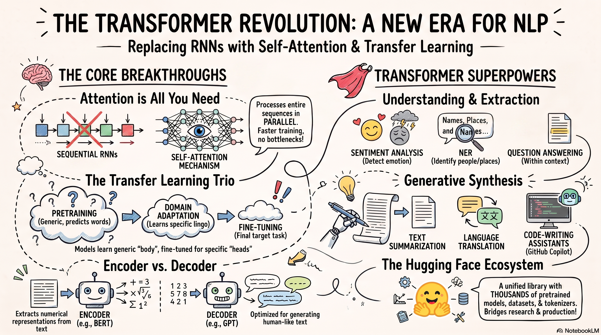

# Attention and Transformers for Beginners

A beginner-friendly, math-first tutorial showing how language modeling evolved from **n-grams** to **Transformers**.

<p align="center">
  
</p>

> Move your existing `The_Transformer_Revolution_for_NLP.png` file into the `images/` folder so the image above appears correctly.

```text
n-grams → RNNs → LSTMs/GRUs → seq2seq attention → self-attention → Transformers
```

## What you will learn

- why fixed-context language models struggle with long dependencies;
- how RNNs, LSTMs, and GRUs represent sequences;
- how Bahdanau and Luong attention improved seq2seq models;
- how queries, keys, values, and scaled dot-product attention work;
- how Transformer encoders and decoders are constructed;
- how to calculate a small self-attention example by hand;
- how to implement attention with NumPy.

## Learning path

| Part | Topic | Open |
|---:|---|---|
| 1 | n-grams, RNNs, LSTMs, and GRUs | [Read](docs/01-language-models.md) |
| 2 | Seq2seq and recurrent attention | [Read](docs/02-seq2seq-and-recurrent-attention.md) |
| 3 | Self-attention and multi-head attention | [Read](docs/03-self-attention.md) |
| 4 | Transformer encoder | [Read](docs/04-transformer-encoder.md) |
| 5 | Transformer decoder and training | [Read](docs/05-transformer-decoder-and-training.md) |
| 6 | Strengths and limitations | [Read](docs/06-strengths-and-limitations.md) |
| 7 | NumPy implementation | [Read](docs/07-numpy-implementation.md) |
| 8 | Practice exercises | [Read](docs/08-practice-exercises.md) |
| 9 | Key takeaways and references | [Read](docs/09-key-takeaways-and-references.md) |

## Run the NumPy example

```bash
git clone https://github.com/amirmasoud-iravani/language-models-evolution.git
cd language-models-evolution
python code/attention_numpy.py
```

Expected attention weights:

```text
[[0.401 0.198 0.401]
 [0.198 0.401 0.401]
 [0.248 0.248 0.503]]
```

## Repository structure

```text
language-models-evolution/
├── README.md
├── docs/
│   ├── 01-language-models.md
│   ├── 02-seq2seq-and-recurrent-attention.md
│   ├── 03-self-attention.md
│   ├── 04-transformer-encoder.md
│   ├── 05-transformer-decoder-and-training.md
│   ├── 06-strengths-and-limitations.md
│   ├── 07-numpy-implementation.md
│   ├── 08-practice-exercises.md
│   └── 09-key-takeaways-and-references.md
├── code/
│   └── attention_numpy.py
└── images/
    └── The_Transformer_Revolution_for_NLP.png
```

## Formatting note

The chapter titles use ordinary Markdown text rather than LaTeX symbols. Mathematical notation is kept inside GitHub math blocks so headings remain consistent, readable, and linkable.

## Main formula

$$
\mathrm{Attention}(Q,K,V)
=
\mathrm{softmax}
\left(
\frac{QK^\top}{\sqrt{d_k}}
\right)V
$$

## References

The tutorial is based on foundational work on neural language models, LSTMs, GRUs, seq2seq learning, recurrent attention, and the Transformer. See [Part 9](docs/09-key-takeaways-and-references.md) for the complete reference list.
