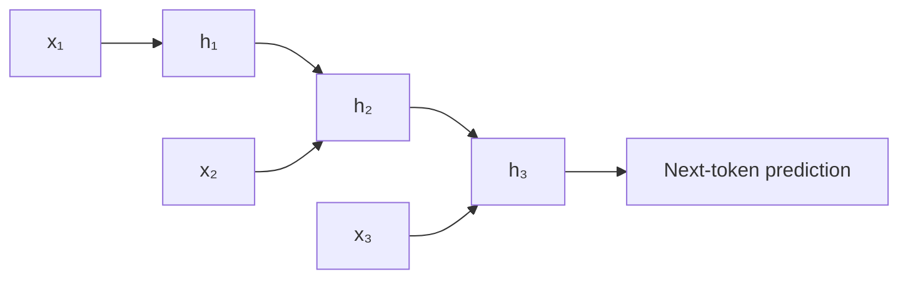

# Part 1 — From n-grams to gated RNNs

[← Main README](../README.md) · [Next →](./02-seq2seq-and-recurrent-attention.md)

---

## 1. The language-modeling problem

A language model assigns a probability to a sequence of tokens:

```math
P(w_1, w_2, \ldots, w_T)
```

Using the probability chain rule:

```math
P(w_1, w_2, \ldots, w_T) = \prod_{t=1}^{T} P(w_t \mid w_1, \ldots, w_{t-1})
```

For the sentence:

> I like Persian poetry

the probability is decomposed as:

```math
P(\text{I}) \cdot P(\text{like} \mid \text{I}) \cdot P(\text{Persian} \mid \text{I like}) \cdot P(\text{poetry} \mid \text{I like Persian})
```

The central NLP problem is therefore:

> How should a model represent the previous context when predicting the next token?

Different generations of language models answer this question differently.

---

## 2. Statistical n-gram models

An n-gram model uses only a fixed number of previous tokens.

For a trigram model:

```math
P(w_t \mid w_1, \ldots, w_{t-1}) \approx P(w_t \mid w_{t-2}, w_{t-1})
```

The probability can be estimated from corpus counts:

```math
P(w_t \mid w_{t-2}, w_{t-1}) = \frac{C(w_{t-2}, w_{t-1}, w_t)}{C(w_{t-2}, w_{t-1})}
```

### Example

Suppose a corpus contains:

```math
C(\text{I like}) = 40
```

and:

```math
C(\text{I like tea}) = 30
```

Then:

```math
P(\text{tea} \mid \text{I like}) = \frac{30}{40} = 0.75
```

So the trigram model assigns probability $0.75$ to *tea* after *I like*.

### Main limitations

#### 1. Fixed context

A trigram model sees only two previous tokens.

Consider:

> The book that I bought yesterday was expensive.

To predict *was*, the subject *book* is several tokens away. A trigram model cannot directly use that dependency.

#### 2. Data sparsity

If an n-gram never appears in the training corpus, its raw count is zero.

For example:

```math
C(\text{I enjoy saffron tea}) = 0
```

This does not mean that the phrase is impossible. It may simply be absent from the corpus.

Smoothing methods reduce this problem, but they do not eliminate the fixed-context limitation.

#### 3. Weak semantic sharing

These sentences are semantically similar:

- I like tea.
- I enjoy coffee.

A symbolic n-gram model does not naturally understand that *like* and *enjoy* are related or that *tea* and *coffee* are related.

---

## 3. Recurrent neural networks

A recurrent neural network processes a sequence one token at a time.

At time step $t$, it computes:

```math
h_t = \tanh\left(W_x x_t + W_h h_{t-1} + b_h\right)
```

where:

- $x_t$ is the current token representation;
- $h_{t-1}$ is the previous hidden state;
- $h_t$ is the new hidden state.

The next-token distribution is:

```math
P(w_{t+1} \mid w_{\leq t}) = \operatorname{softmax}\left(W_o h_t + b_o\right)
```

The hidden state is intended to summarize the sequence seen so far.



### A tiny scalar example

Assume a one-dimensional RNN:

```math
h_t = \tanh\left(x_t + 0.5h_{t-1}\right)
```

Let:

```math
h_0 = 0
```

and input values:

```math
x_1 = 1, \qquad x_2 = 0.5
```

Then:

```math
h_1 = \tanh\left(1 + 0.5(0)\right) = \tanh(1) \approx 0.762
```

Next:

```math
h_2 = \tanh\left(0.5 + 0.5(0.762)\right) = \tanh(0.881) \approx 0.707
```

The second state contains information from both $x_2$ and the previous state.

### Why ordinary RNNs struggle with long sequences

During backpropagation, gradients pass through many recurrent transitions:

```math
\frac{\partial h_t}{\partial h_{t-k}} = \prod_{j=t-k+1}^{t} \frac{\partial h_j}{\partial h_{j-1}}
```

Suppose each local derivative is approximately $0.5$. After ten steps:

```math
0.5^{10} \approx 0.00098
```

The training signal becomes extremely small. This is the **vanishing-gradient problem**.

If the repeated derivative is larger than $1$, the gradient may instead become extremely large. This is the **exploding-gradient problem**.

RNNs also remain sequential:

```math
h_1 \rightarrow h_2 \rightarrow h_3 \rightarrow \cdots \rightarrow h_n
```

The model cannot compute $h_{10}$ before computing $h_1, \ldots, h_9$.

---

## 4. LSTM and GRU

LSTM and GRU architectures introduce gates that control the flow of information.

### 4.1 LSTM

An LSTM has a hidden state $h_t$ and a cell state $c_t$.

#### Forget gate

```math
f_t = \sigma\left(W_f[x_t; h_{t-1}] + b_f\right)
```

The forget gate decides how much old memory to preserve.

#### Input gate

```math
i_t = \sigma\left(W_i[x_t; h_{t-1}] + b_i\right)
```

The input gate decides how much new information should enter the cell state.

#### Candidate memory

```math
\tilde{c}_t = \tanh\left(W_c[x_t; h_{t-1}] + b_c\right)
```

The candidate memory contains new information that may be added to the cell state.

#### Cell-state update

```math
c_t = f_t \odot c_{t-1} + i_t \odot \tilde{c}_t
```

The first term preserves selected old information, while the second term adds selected new information.

#### Output gate

```math
o_t = \sigma\left(W_o[x_t; h_{t-1}] + b_o\right)
```

#### Hidden state

```math
h_t = o_t \odot \tanh(c_t)
```

Here, $\odot$ means element-wise multiplication.

### Scalar LSTM example

Suppose:

```math
c_{t-1} = 0.8
```

and:

```math
f_t = 0.9, \qquad i_t = 0.3, \qquad \tilde{c}_t = 0.5
```

Then:

```math
c_t = 0.9(0.8) + 0.3(0.5) = 0.72 + 0.15 = 0.87
```

If:

```math
o_t = 0.7
```

then:

```math
h_t = 0.7\tanh(0.87) \approx 0.7(0.701) \approx 0.491
```

The model preserves most of the old memory and adds a smaller amount of new information.

### 4.2 GRU

A GRU is a simpler gated recurrent model.

#### Update gate

```math
z_t = \sigma\left(W_z x_t + U_z h_{t-1} + b_z\right)
```

#### Reset gate

```math
r_t = \sigma\left(W_r x_t + U_r h_{t-1} + b_r\right)
```

#### Candidate state

```math
\tilde{h}_t = \tanh\left(W_h x_t + U_h(r_t \odot h_{t-1}) + b_h\right)
```

#### Final state

One common convention is:

```math
h_t = (1-z_t) \odot h_{t-1} + z_t \odot \tilde{h}_t
```

### Scalar GRU example

Suppose:

```math
h_{t-1} = 0.6, \qquad z_t = 0.25, \qquad \tilde{h}_t = 0.2
```

Then:

```math
h_t = 0.75(0.6) + 0.25(0.2) = 0.45 + 0.05 = 0.50
```

The result remains mostly based on the old state.

### What LSTMs and GRUs solved

They improved:

- gradient flow;
- long-term memory;
- control over forgetting and updating.

### What they did not solve

They still process tokens sequentially:

```math
h_1 \rightarrow h_2 \rightarrow \cdots \rightarrow h_n
```

Long-distance information still passes through many recurrent steps.

---
