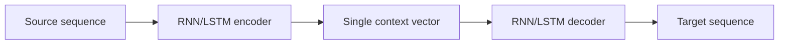

# Part 2 — Seq2seq and recurrent attention

[← Main README](../README.md) · [← Previous](./01-language-models.md) · [Next →](./03-self-attention.md)

---

## 5. The seq2seq bottleneck

Early neural machine translation systems used an encoder-decoder architecture.

The encoder reads:

$$
x_1,x_2,\ldots,x_n
$$

and produces hidden states:

$$
h_1,h_2,\ldots,h_n
$$

A simple seq2seq model uses only the final state:

$$
c=h_n
$$

The decoder then generates:

$$
s_t=g(y_{t-1},s_{t-1},c)
$$

This forces the whole source sentence into one fixed-size vector $c$.

### Why this is a bottleneck

Consider translating:

> The old book that Sara bought in Tehran last year was surprisingly expensive.

The final encoder state must preserve:

- the main subject;
- the relative clause;
- the place;
- the time;
- the adjective;
- the predicate.

As the sentence grows, important details may be compressed or forgotten.

Attention was introduced to avoid relying on only one fixed context vector.

---

---

## 6. Bahdanau and Luong attention

> Bahdanau and Luong are not alternatives to “attention.” They are early forms of neural attention used inside recurrent seq2seq models.

Instead of using:

$$
c=h_n
$$

the decoder constructs a different context vector for every output step:

$$
c_t=\sum_i\alpha_{t,i}h_i
$$

The decoder can therefore focus on different source words while generating different target words.

### 6.1 The general attention procedure

For each source position $i$:

1. Compute a relevance score:

$$
e_{t,i}=\mathrm{score}(s,h_i)
$$

2. Normalize the scores:

$$
\alpha_{t,i}
=
\frac{\exp(e_{t,i})}
{\sum_j\exp(e_{t,j})}
$$

3. Compute the context vector:

$$
c_t
=
\sum_i\alpha_{t,i}h_i
$$

The weights satisfy:

$$
\alpha_{t,i}\geq0
$$

and:

$$
\sum_i\alpha_{t,i}=1
$$

### 6.2 Bahdanau attention

Bahdanau attention is often called **additive attention**:

$$
e_{t,i}
=
v_a^\top
\tanh(W_ss_{t-1}+W_hh_i+b_a)
$$

The decoder state and encoder state are projected, added, passed through $\tanh$, and then reduced to a scalar score.

### 6.3 Luong attention

Luong attention proposed several scoring functions.

#### Dot product

$$
e_{t,i}=s_t^\top h_i
$$

#### General

$$
e_{t,i}=s_t^\top W_ah_i
$$

#### Concatenation

$$
e_{t,i}
=
v_a^\top\tanh(W_a[s_t;h_i])
$$

Luong also distinguished:

- **global attention**, which scores all source positions;
- **local attention**, which focuses on a smaller predicted window.

### Translation example

Source:

> علی کتاب را خواند

Target:

> Ali read the book

An illustrative attention matrix might be:

| Target token | علی | کتاب | را | خواند |
|---|---:|---:|---:|---:|
| Ali | 0.82 | 0.05 | 0.03 | 0.10 |
| read | 0.08 | 0.10 | 0.04 | 0.78 |
| the | 0.05 | 0.35 | 0.50 | 0.10 |
| book | 0.04 | 0.76 | 0.15 | 0.05 |

These values are illustrative, but they show the idea:

- generating *Ali* focuses on **علی**;
- generating *read* focuses on **خواند**;
- generating *book* focuses on **کتاب**.

### What recurrent attention improved

It removed the single-vector bottleneck:

$$
c
\quad\longrightarrow\quad
c_1,c_2,\ldots,c_m
$$

It also created soft alignments between source and target words.

### What remained difficult

Bahdanau and Luong models still contained recurrent encoders and recurrent decoders.

The encoder still followed:

$$
h_1\rightarrow h_2\rightarrow\cdots\rightarrow h_n
$$

The decoder still followed:

$$
s_1\rightarrow s_2\rightarrow\cdots\rightarrow s_m
$$

Attention improved information access, but recurrence remained the computational backbone.

---
