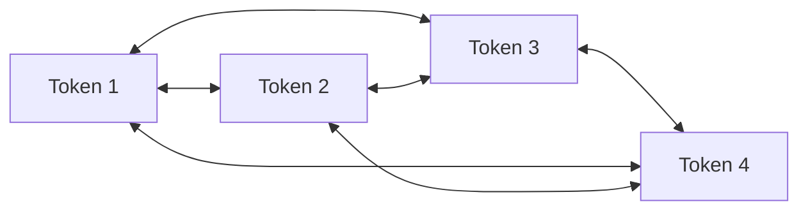

# Part 3 — Self-attention and multi-head attention

[← Main README](../README.md) · [← Previous](./02-seq2seq-and-recurrent-attention.md) · [Next →](./04-transformer-encoder.md)

---

## 7. From recurrent attention to self-attention

Traditional seq2seq attention asks:

> Which encoder states should the decoder use now?

Self-attention asks a more general question:

> Which tokens in this sequence should each token use?

Consider:

> The animal did not cross the street because it was tired.

When building a contextual representation for *it*, self-attention can directly examine:

- *animal*;
- *street*;
- *tired*;
- all other tokens.

The model may assign high attention to *animal* because it is a plausible antecedent of *it*.

The Transformer makes self-attention the central operation and removes recurrent connections from its main architecture.

In one self-attention layer, every token can directly interact with every other token.

---

---

## 8. Queries, keys, and values

Attention uses three representations:

- **Query:** what information is this token looking for?
- **Key:** what information does another token advertise?
- **Value:** what information should be retrieved from that token?

A useful analogy is semantic search.

Suppose a token representing *it* asks:

> Which earlier token is a plausible antecedent?

That request is its query.

Each earlier token has a key describing how it can be matched. If *animal* has a key that matches strongly, its value contributes heavily to the new representation of *it*.

Given an input matrix:

$$
X\in\mathbb{R}^{n\times d_{\text{model}}}
$$

the model learns:

$$
Q=XW^Q
$$

$$
K=XW^K
$$

$$
V=XW^V
$$

where:

- $Q\in\mathbb{R}^{n\times d_k}$;
- $K\in\mathbb{R}^{n\times d_k}$;
- $V\in\mathbb{R}^{n\times d_v}$.

The matrices $W^Q,W^K,W^V$ are learned during training.

---

---

## 9. Scaled dot-product attention

The main Transformer attention formula is:

$$
\boxed{
\mathrm{Attention}(Q,K,V)
=
\mathrm{softmax}
\left(
\frac{QK^\top}{\sqrt{d_k}}
\right)V
}
$$

Let us unpack it.

### 9.1 Similarity scores

$$
QK^\top
$$

produces an $n\times n$ matrix.

Entry $(i,j)$ is:

$$
q_i^\top k_j
$$

This measures how relevant token $j$ is to token $i$.

### 9.2 Scaling

The scores are divided by:

$$
\sqrt{d_k}
$$

Why?

If query and key components have variance close to $1$, then:

$$
q^\top k
=
\sum_{\ell=1}^{d_k}q_\ell k_\ell
$$

tends to grow in magnitude as $d_k$ grows.

Large scores can make softmax extremely sharp. One position may receive probability close to $1$, while the rest receive values close to $0$. That can produce weak gradients.

Dividing by $\sqrt{d_k}$ keeps the score scale more stable.

### 9.3 Softmax

Softmax converts each row into a probability distribution:

$$
\alpha_{ij}
=
\frac{
\exp(s_{ij})
}{
\sum_m\exp(s_{im})
}
$$

where:

$$
s_{ij}
=
\frac{q_i^\top k_j}{\sqrt{d_k}}
$$

### 9.4 Weighted value combination

Finally:

$$
o_i=\sum_j\alpha_{ij}v_j
$$

Each token receives a weighted mixture of value vectors from all tokens.

---

---

## 10. A complete numerical self-attention example

Use three tokens:

$$
[\text{Ali},\text{book},\text{read}]
$$

For simplicity, assign artificial two-dimensional vectors:

$$
X=
\begin{bmatrix}
1&0\\
0&1\\
1&1
\end{bmatrix}
$$

Assume:

$$
W^Q=W^K=W^V=I
$$

Therefore:

$$
Q=K=V=X
$$

This identity-matrix assumption is only for demonstration. In a real Transformer, the projection matrices are learned.

### Step 1: Compute the score matrix

$$
QK^\top
=
\begin{bmatrix}
1&0\\
0&1\\
1&1
\end{bmatrix}
\begin{bmatrix}
1&0&1\\
0&1&1
\end{bmatrix}
$$

$$
QK^\top
=
\begin{bmatrix}
1&0&1\\
0&1&1\\
1&1&2
\end{bmatrix}
$$

Interpretation:

- the first token has dot product $1$ with itself;
- it has dot product $0$ with the second token;
- it has dot product $1$ with the third token.

### Step 2: Scale the score matrix

Here:

$$
d_k=2
$$

so:

$$
\sqrt{d_k}=\sqrt{2}\approx1.414
$$

Therefore:

$$
S
=
\frac{QK^\top}{\sqrt{2}}
\approx
\begin{bmatrix}
0.707&0&0.707\\
0&0.707&0.707\\
0.707&0.707&1.414
\end{bmatrix}
$$

### Step 3: Apply softmax row by row

$$
A=\mathrm{softmax}(S)
$$

Approximately:

$$
A=
\begin{bmatrix}
0.401&0.198&0.401\\
0.198&0.401&0.401\\
0.248&0.248&0.503
\end{bmatrix}
$$

Each row sums to $1$.

The first row means that the first token retrieves:

- $40.1\%$ from token 1;
- $19.8\%$ from token 2;
- $40.1\%$ from token 3.

### Step 4: Combine the value vectors

$$
O=AV
$$

$$
O=
\begin{bmatrix}
0.401&0.198&0.401\\
0.198&0.401&0.401\\
0.248&0.248&0.503
\end{bmatrix}
\begin{bmatrix}
1&0\\
0&1\\
1&1
\end{bmatrix}
$$

The result is:

$$
O
\approx
\begin{bmatrix}
0.802&0.599\\
0.599&0.802\\
0.752&0.752
\end{bmatrix}
$$

The original first-token vector was:

$$
[1,0]
$$

Its contextualized vector becomes:

$$
[0.802,0.599]
$$

It now contains information retrieved from the other tokens.

> Self-attention does not merely decide which tokens are important. It constructs a new representation by mixing their value vectors.

---

---

## 11. Multi-head attention

A single attention operation produces one pattern of relationships.

Language contains many kinds of relationships:

- subject–verb;
- verb–object;
- pronoun–antecedent;
- adjective–noun;
- semantic similarity;
- positional relationships.

Multi-head attention computes several attention operations in parallel.

For head $j$:

$$
\mathrm{head}_j
=
\mathrm{Attention}
(
XW_j^Q,
XW_j^K,
XW_j^V
)
$$

The heads are concatenated:

$$
H=
[
\mathrm{head}_1;
\mathrm{head}_2;
\ldots;
\mathrm{head}_h
]
$$

Then projected:

$$
\mathrm{MultiHead}(X)=HW^O
$$

### Shape example

Suppose:

$$
d_{\text{model}}=512
$$

and:

$$
h=8
$$

A common arrangement is:

$$
d_k=d_v=64
$$

because:

$$
8\times64=512
$$

Each head works in its own learned subspace.

One head may become useful for local syntactic relations, while another may help with long-distance dependencies. However, individual heads are not guaranteed to have a clean human-interpretable function.

---
