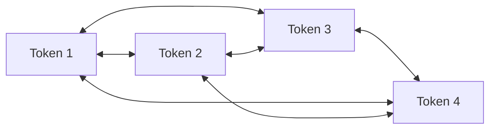

# Part 3 — Self-Attention and Multi-Head Attention

[← Main README](../README.md) · [← Previous](./02-seq2seq-and-recurrent-attention.md) · [Next →](./04-transformer-encoder.md)

---

## 7. From Recurrent Attention to Self-Attention

Traditional sequence-to-sequence (seq2seq) attention asks:

> Which encoder states should the decoder use now?

Self-attention asks a more general question:

> Which tokens in this sequence should each token use?

Consider the following sentence:

> The animal did not cross the street because it was tired.

When building a contextual representation for *it*, self-attention can directly examine:

- *animal*
- *street*
- *tired*
- all other tokens

The model may assign high attention to *animal* because it is a plausible antecedent of *it*.

The Transformer makes self-attention its central operation and removes recurrent connections from its main architecture.



In one self-attention layer, every token can directly interact with every other token.

---

## 8. Queries, Keys, and Values

Attention uses three representations:

- **Query:** What information is this token looking for?
- **Key:** What information does another token advertise?
- **Value:** What information should be retrieved from that token?

A useful analogy is semantic search.

Suppose a token representing *it* asks:

> Which earlier token is a plausible antecedent?

That request is its query.

Each earlier token has a key describing how it can be matched. If *animal* has a key that matches strongly, its value contributes heavily to the new representation of *it*.

Given an input matrix:

```math
X \in \mathbb{R}^{n \times d_{\mathrm{model}}}
```

the model learns three projections:

```math
Q = XW^Q
```

```math
K = XW^K
```

```math
V = XW^V
```

where:

- $Q \in \mathbb{R}^{n \times d_k}$
- $K \in \mathbb{R}^{n \times d_k}$
- $V \in \mathbb{R}^{n \times d_v}$

The matrices $W^Q$, $W^K$, and $W^V$ are learned during training.

---

## 9. Scaled Dot-Product Attention

The main Transformer attention formula is:

```math
\mathrm{Attention}(Q,K,V)
=
\mathrm{softmax}\left(
\frac{QK^{\top}}{\sqrt{d_k}}
\right)V
```

Let us unpack it.

### 9.1. Similarity Scores

```math
QK^{\top}
```

This operation produces an $n \times n$ matrix.

Entry $(i,j)$ is:

```math
q_i^{\top}k_j
```

This value measures how relevant token $j$ is to token $i$.

### 9.2. Scaling

The scores are divided by:

```math
\sqrt{d_k}
```

Why is scaling necessary?

If query and key components have variance close to $1$, then:

```math
q^{\top}k
=
\sum_{\ell=1}^{d_k} q_{\ell}k_{\ell}
```

The magnitude of this dot product tends to grow as $d_k$ increases.

Large scores can make softmax extremely sharp. One position may receive a probability close to $1$, while the remaining positions receive values close to $0$. This saturation can produce weak gradients.

Dividing by $\sqrt{d_k}$ keeps the scale of the scores more stable.

### 9.3. Softmax

Softmax converts each row into a probability distribution:

```math
\alpha_{ij}
=
\frac{\exp(s_{ij})}
{\sum_m \exp(s_{im})}
```

where:

```math
s_{ij}
=
\frac{q_i^{\top}k_j}{\sqrt{d_k}}
```

### 9.4. Weighted Value Combination

Finally:

```math
o_i
=
\sum_j \alpha_{ij}v_j
```

Each token receives a weighted mixture of the value vectors from all tokens.

---

## 10. A Complete Numerical Self-Attention Example

Consider three tokens:

```math
[\mathrm{Ali},\ \mathrm{book},\ \mathrm{read}]
```

For simplicity, assign artificial two-dimensional vectors:

```math
X
=
\begin{bmatrix}
1 & 0 \\
0 & 1 \\
1 & 1
\end{bmatrix}
```

Assume:

```math
W^Q = W^K = W^V = I
```

Therefore:

```math
Q = K = V = X
```

This identity-matrix assumption is used only for demonstration. In a real Transformer, the projection matrices are learned.

### Step 1: Compute the Score Matrix

```math
\begin{aligned}
QK^{\top}
&=
\begin{bmatrix}
1 & 0 \\
0 & 1 \\
1 & 1
\end{bmatrix}
\begin{bmatrix}
1 & 0 & 1 \\
0 & 1 & 1
\end{bmatrix} \\
&=
\begin{bmatrix}
1 & 0 & 1 \\
0 & 1 & 1 \\
1 & 1 & 2
\end{bmatrix}
\end{aligned}
```

Interpretation:

- The first token has a dot product of $1$ with itself.
- It has a dot product of $0$ with the second token.
- It has a dot product of $1$ with the third token.

### Step 2: Scale the Score Matrix

Here:

```math
d_k = 2
```

Therefore:

```math
\sqrt{d_k} = \sqrt{2} \approx 1.414
```

The scaled score matrix is:

```math
\begin{aligned}
S
&=
\frac{QK^{\top}}{\sqrt{2}} \\
&\approx
\begin{bmatrix}
0.707 & 0     & 0.707 \\
0     & 0.707 & 0.707 \\
0.707 & 0.707 & 1.414
\end{bmatrix}
\end{aligned}
```

### Step 3: Apply Softmax Row by Row

```math
A = \mathrm{softmax}(S)
```

Approximately:

```math
A
\approx
\begin{bmatrix}
0.401 & 0.198 & 0.401 \\
0.198 & 0.401 & 0.401 \\
0.248 & 0.248 & 0.503
\end{bmatrix}
```

Each row sums to approximately $1$.

The first row means that the first token retrieves:

- $40.1\%$ from token 1
- $19.8\%$ from token 2
- $40.1\%$ from token 3

### Step 4: Combine the Value Vectors

```math
O = AV
```

```math
O
=
\begin{bmatrix}
0.401 & 0.198 & 0.401 \\
0.198 & 0.401 & 0.401 \\
0.248 & 0.248 & 0.503
\end{bmatrix}
\begin{bmatrix}
1 & 0 \\
0 & 1 \\
1 & 1
\end{bmatrix}
```

The result is:

```math
O
\approx
\begin{bmatrix}
0.802 & 0.599 \\
0.599 & 0.802 \\
0.752 & 0.752
\end{bmatrix}
```

The original first-token vector was:

```math
\begin{bmatrix}
1 & 0
\end{bmatrix}
```

Its contextualized vector becomes:

```math
\begin{bmatrix}
0.802 & 0.599
\end{bmatrix}
```

It now contains information retrieved from the other tokens.

> Self-attention does not merely decide which tokens are important. It constructs a new representation by mixing their value vectors.

---

## 11. Multi-Head Attention

A single attention operation produces one pattern of relationships.

Language contains many kinds of relationships, including:

- subject–verb
- verb–object
- pronoun–antecedent
- adjective–noun
- semantic similarity
- positional relationships

Multi-head attention computes several attention operations in parallel.

For head $j$:

```math
\mathrm{head}_j
=
\mathrm{Attention}\left(
XW_j^Q,
XW_j^K,
XW_j^V
\right)
```

The heads are concatenated:

```math
H
=
\mathrm{Concat}\left(
\mathrm{head}_1,
\mathrm{head}_2,
\ldots,
\mathrm{head}_h
\right)
```

They are then projected:

```math
\mathrm{MultiHead}(X) = HW^O
```

### Shape Example

Suppose:

```math
d_{\mathrm{model}} = 512
```

and:

```math
h = 8
```

A common arrangement is:

```math
d_k = d_v = 64
```

because:

```math
8 \times 64 = 512
```

Each head works in its own learned subspace.

One head may become useful for local syntactic relations, while another may help with long-distance dependencies. However, individual heads are not guaranteed to have a clean, human-interpretable function.

---
