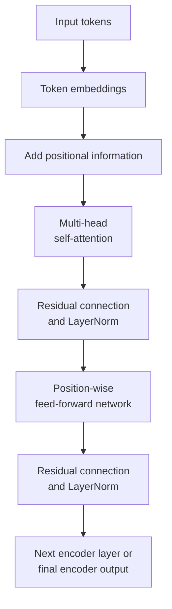

# Part 4 — The Transformer encoder

[← Main README](../README.md) · [← Previous](./03-self-attention.md) · [Next →](./05-transformer-decoder-and-training.md)

---

## 12. The Transformer encoder

The original Transformer encoder contains repeated layers.



A simplified encoder layer is:

```math
\text{Self-attention}
\;\longrightarrow\;
\text{Add \& Norm}
\;\longrightarrow\;
\text{Feed-forward}
\;\longrightarrow\;
\text{Add \& Norm}
```

### 12.1 Token embeddings

Each token ID indexes a learned embedding matrix:

```math
E \in \mathbb{R}^{|V| \times d_{\mathrm{model}}}
```

If token $t_i$ has vocabulary ID $k$, then:

```math
x_i = E_k
```

For example:

```math
E_{\text{book}}
=
\begin{bmatrix}
0.2 & -0.1 & 0.7 & 0.4
\end{bmatrix}
```

Embeddings represent lexical information, but they do not inherently represent token order.

### 12.2 Positional encoding

Without positional information, self-attention would treat these token sets similarly:

- dog bites man
- man bites dog

The original Transformer adds sinusoidal positional encodings:

```math
\operatorname{PE}(\mathrm{pos}, 2i)
=
\sin\left(
\frac{\mathrm{pos}}
{10000^{2i/d_{\mathrm{model}}}}
\right)
```

```math
\operatorname{PE}(\mathrm{pos}, 2i+1)
=
\cos\left(
\frac{\mathrm{pos}}
{10000^{2i/d_{\mathrm{model}}}}
\right)
```

The input representation is:

```math
z_i = x_i + \operatorname{PE}(i)
```

### Small positional example

Let:

```math
d_{\mathrm{model}} = 4
```

and position:

```math
\mathrm{pos} = 2
```

Then:

```math
\operatorname{PE}(2,0) = \sin(2) \approx 0.909
```

```math
\operatorname{PE}(2,1) = \cos(2) \approx -0.416
```

For the next frequency:

```math
10000^{2/4} = 100
```

Therefore:

```math
\operatorname{PE}(2,2) = \sin(2/100) \approx 0.020
```

```math
\operatorname{PE}(2,3) = \cos(2/100) \approx 1.000
```

So:

```math
\operatorname{PE}(2)
\approx
\begin{bmatrix}
0.909 & -0.416 & 0.020 & 1.000
\end{bmatrix}
```

If the token embedding is:

```math
x_i =
\begin{bmatrix}
0.2 & -0.1 & 0.7 & 0.4
\end{bmatrix}
```

then:

```math
z_i = x_i + \operatorname{PE}(i)
```

```math
z_i
\approx
\begin{bmatrix}
1.109 & -0.516 & 0.720 & 1.400
\end{bmatrix}
```

The model now receives both token identity and positional information.

### 12.3 Residual connections

For a sublayer $f(x)$, a residual connection returns:

```math
x + f(x)
```

For self-attention:

```math
z = x + \operatorname{SelfAttention}(x)
```

Example:

```math
x =
\begin{bmatrix}
1 & 2 & 3
\end{bmatrix}
```

```math
f(x) =
\begin{bmatrix}
0.5 & -0.5 & 1
\end{bmatrix}
```

Then:

```math
x + f(x) =
\begin{bmatrix}
1.5 & 1.5 & 4
\end{bmatrix}
```

Residual connections help:

- preserve the original representation;
- improve gradient flow;
- make deep networks easier to train.

### 12.4 Layer normalization

For a vector:

```math
z =
\begin{bmatrix}
z_1 & z_2 & \cdots & z_d
\end{bmatrix}
```

compute:

```math
\mu
=
\frac{1}{d}
\sum_{j=1}^{d} z_j
```

and:

```math
\sigma^2
=
\frac{1}{d}
\sum_{j=1}^{d} (z_j-\mu)^2
```

Layer normalization is:

```math
\operatorname{LN}(z)
=
\gamma \odot
\frac{z-\mu}
{\sqrt{\sigma^2+\epsilon}}
+
\beta
```

where $\gamma$ and $\beta$ are learned parameters.

#### Numerical example

Let:

```math
z =
\begin{bmatrix}
1.5 & 1.5 & 4
\end{bmatrix}
```

Mean:

```math
\mu
=
\frac{1.5+1.5+4}{3}
=
2.333
```

Variance:

```math
\begin{aligned}
\sigma^2
&=
\frac{
(1.5-2.333)^2
+
(1.5-2.333)^2
+
(4-2.333)^2
}{3} \\
&\approx 1.389
\end{aligned}
```

Standard deviation:

```math
\sigma \approx 1.179
```

Ignoring $\gamma$, $\beta$, and $\epsilon$:

```math
\operatorname{LN}(z)
\approx
\begin{bmatrix}
-0.707 & -0.707 & 1.414
\end{bmatrix}
```

Layer normalization stabilizes the scale of activations.

### 12.5 Position-wise feed-forward network

After attention, every token independently passes through the same feed-forward network:

```math
\operatorname{FFN}(x)
=
\operatorname{ReLU}(xW_1+b_1)W_2+b_2
```

The same parameters are applied at every sequence position.

Attention mixes information **between tokens**.

The FFN transforms information **inside each token representation**.

### Numerical FFN example

Let:

```math
x =
\begin{bmatrix}
1 & -2
\end{bmatrix}
```

```math
W_1 =
\begin{bmatrix}
1 & 0 & 1 \\
0 & 1 & -1
\end{bmatrix}
```

Then:

```math
xW_1 =
\begin{bmatrix}
1 & -2 & 3
\end{bmatrix}
```

Applying ReLU:

```math
\operatorname{ReLU}\left(
\begin{bmatrix}
1 & -2 & 3
\end{bmatrix}
\right)
=
\begin{bmatrix}
1 & 0 & 3
\end{bmatrix}
```

Let:

```math
W_2 =
\begin{bmatrix}
1 & 0 \\
0 & 1 \\
1 & 1
\end{bmatrix}
```

Then:

```math
\begin{bmatrix}
1 & 0 & 3
\end{bmatrix}
W_2
=
\begin{bmatrix}
4 & 3
\end{bmatrix}
```

The FFN transforms:

```math
\begin{bmatrix}
1 & -2
\end{bmatrix}
\longrightarrow
\begin{bmatrix}
4 & 3
\end{bmatrix}
```

In the original Transformer:

```math
512 \longrightarrow 2048 \longrightarrow 512
```

The temporary expansion gives the network more space for nonlinear feature construction.

### 12.6 One complete encoder layer

Using the original post-normalization arrangement:

```math
A = \operatorname{MultiHeadSelfAttention}(X)
```

```math
X' = \operatorname{LayerNorm}(X+A)
```

```math
F = \operatorname{FFN}(X')
```

```math
Y = \operatorname{LayerNorm}(X'+F)
```

The output $Y$ becomes the input to the next encoder layer.

### Tensor shapes

Suppose:

```math
n=4,
\qquad
d_{\mathrm{model}}=8,
\qquad
h=2
```

Then:

```math
X \in \mathbb{R}^{4 \times 8}
```

Each head may use:

```math
d_k = d_v = 4
```

For one head:

```math
Q,K,V \in \mathbb{R}^{4 \times 4}
```

The attention-score matrix is:

```math
QK^{\mathsf{T}} \in \mathbb{R}^{4 \times 4}
```

The head output has shape:

```math
4 \times 4
```

Two heads are concatenated:

```math
(4 \times 4) \mathbin{\|} (4 \times 4)
\longrightarrow
4 \times 8
```

The encoder layer returns a tensor with shape:

```math
4 \times 8
```

---
