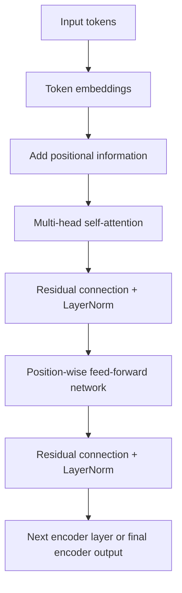

# Part 4 — The Transformer encoder

[← Main README](../README.md) · [← Previous](./03-self-attention.md) · [Next →](./05-transformer-decoder-and-training.md)

---

## 12. The Transformer encoder

The original Transformer encoder contains repeated layers.

A simplified encoder layer is:

$$
\text{Self-attention}
\rightarrow
\text{Add \& Norm}
\rightarrow
\text{Feed-forward}
\rightarrow
\text{Add \& Norm}
$$

### 12.1 Token embeddings

Each token ID indexes a learned embedding matrix:

$$
E\in\mathbb{R}^{|V|\times d_{\text{model}}}
$$

If token $t_i$ has vocabulary ID $k$, then:

$$
x_i=E_k
$$

For example:

$$
E_{\text{book}}
=
[0.2,-0.1,0.7,0.4]
$$

Embeddings represent lexical information, but they do not inherently represent token order.

### 12.2 Positional encoding

Without positional information, self-attention would treat these token sets similarly:

- dog bites man
- man bites dog

The original Transformer adds sinusoidal positional encodings:

$$
PE(\text{pos},2i)
=
\sin
\left(
\frac{\text{pos}}
{10000^{2i/d_{\text{model}}}}
\right)
$$

$$
PE(\text{pos},2i+1)
=
\cos
\left(
\frac{\text{pos}}
{10000^{2i/d_{\text{model}}}}
\right)
$$

The input representation is:

$$
z_i=x_i+PE(i)
$$

### Small positional example

Let:

$$
d_{\text{model}}=4
$$

and position:

$$
\text{pos}=2
$$

Then:

$$
PE(2,0)=\sin(2)\approx0.909
$$

$$
PE(2,1)=\cos(2)\approx-0.416
$$

For the next frequency:

$$
10000^{2/4}=100
$$

Therefore:

$$
PE(2,2)=\sin(2/100)\approx0.020
$$

$$
PE(2,3)=\cos(2/100)\approx1.000
$$

So:

$$
PE(2)
\approx
[0.909,-0.416,0.020,1.000]
$$

If the token embedding is:

$$
x_i=[0.2,-0.1,0.7,0.4]
$$

then:

$$
z_i=x_i+PE(i)
$$

$$
z_i
\approx
[1.109,-0.516,0.720,1.400]
$$

The model now receives both token identity and positional information.

### 12.3 Residual connections

For a sublayer $f(x)$, a residual connection returns:

$$
x+f(x)
$$

For self-attention:

$$
z=x+\mathrm{SelfAttention}(x)
$$

Example:

$$
x=[1,2,3]
$$

$$
f(x)=[0.5,-0.5,1]
$$

Then:

$$
x+f(x)=[1.5,1.5,4]
$$

Residual connections help:

- preserve the original representation;
- improve gradient flow;
- make deep networks easier to train.

### 12.4 Layer normalization

For a vector:

$$
z=[z_1,z_2,\ldots,z_d]
$$

compute:

$$
\mu
=
\frac{1}{d}
\sum_{j=1}^{d}z_j
$$

and:

$$
\sigma^2
=
\frac{1}{d}
\sum_{j=1}^{d}(z_j-\mu)^2
$$

Layer normalization is:

$$
\mathrm{LN}(z)
=
\gamma\odot
\frac{z-\mu}
{\sqrt{\sigma^2+\epsilon}}
+
\beta
$$

where $\gamma$ and $\beta$ are learned parameters.

#### Numerical example

Let:

$$
z=[1.5,1.5,4]
$$

Mean:

$$
\mu
=
\frac{1.5+1.5+4}{3}
=
2.333
$$

Variance:

$$
\sigma^2
=
\frac{
(1.5-2.333)^2+
(1.5-2.333)^2+
(4-2.333)^2
}{3}
\approx1.389
$$

Standard deviation:

$$
\sigma\approx1.179
$$

Ignoring $\gamma$, $\beta$, and $\epsilon$:

$$
\mathrm{LN}(z)
\approx
[-0.707,-0.707,1.414]
$$

Layer normalization stabilizes the scale of activations.

### 12.5 Position-wise feed-forward network

After attention, every token independently passes through the same feed-forward network:

$$
\mathrm{FFN}(x)
=
\mathrm{ReLU}(xW_1+b_1)W_2+b_2
$$

The same parameters are applied at every sequence position.

Attention mixes information **between tokens**.

The FFN transforms information **inside each token representation**.

### Numerical FFN example

Let:

$$
x=[1,-2]
$$

$$
W_1=
\begin{bmatrix}
1&0&1\\
0&1&-1
\end{bmatrix}
$$

Then:

$$
xW_1=[1,-2,3]
$$

Applying ReLU:

$$
\mathrm{ReLU}([1,-2,3])
=
[1,0,3]
$$

Let:

$$
W_2=
\begin{bmatrix}
1&0\\
0&1\\
1&1
\end{bmatrix}
$$

Then:

$$
[1,0,3]W_2=[4,3]
$$

The FFN transforms:

$$
[1,-2]\rightarrow[4,3]
$$

In the original Transformer:

$$
512\rightarrow2048\rightarrow512
$$

The temporary expansion gives the network more space for nonlinear feature construction.

### 12.6 One complete encoder layer

Using the original post-normalization arrangement:

$$
A=\mathrm{MultiHeadSelfAttention}(X)
$$

$$
X'=\mathrm{LayerNorm}(X+A)
$$

$$
F=\mathrm{FFN}(X')
$$

$$
Y=\mathrm{LayerNorm}(X'+F)
$$

The output $Y$ becomes the input to the next encoder layer.

### Tensor shapes

Suppose:

$$
n=4,\qquad
d_{\text{model}}=8,\qquad
h=2
$$

Then:

$$
X:(4,8)
$$

Each head may use:

$$
d_k=d_v=4
$$

For one head:

$$
Q,K,V:(4,4)
$$

The attention-score matrix is:

$$
QK^\top:(4,4)
$$

The head output is:

$$
(4,4)
$$

Two heads are concatenated:

$$
(4,4)+(4,4)\rightarrow(4,8)
$$

The encoder layer returns:

$$
(4,8)
$$

---
