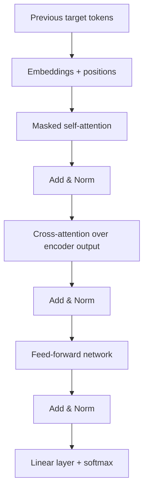

# Part 5 — The Transformer decoder and training

[← Main README](../README.md) · [← Previous](./04-transformer-encoder.md) · [Next →](./06-strengths-and-limitations.md)

---

## 13. The Transformer decoder

The decoder part contains:

1. masked self-attention;
2. encoder-decoder cross-attention;
3. a feed-forward network.



### 13.1 Shifted target input

Suppose the correct target is:

```text
[I, read, the, book, EOS]
```

The decoder input is:

```text
[BOS, I, read, the, book]
```

The desired predictions are:

| Decoder input | Target |
|---|---|
| BOS | I |
| BOS I | read |
| BOS I read | the |
| BOS I read the | book |
| BOS I read the book | EOS |

### 13.2 Masked self-attention

During training, all target tokens are stored in one tensor. However, a position must not see future answers.

A causal mask is added:

```text
M = [
  [0, -inf, -inf],
  [0,    0, -inf],
  [0,    0,    0]
]
```

Attention becomes:

```text
softmax((Q K^T / sqrt(d_k)) + M) V
```

Because:

```text
exp(-inf) = 0
```

future positions receive zero attention probability.

For four tokens, the permitted pattern is:

```text
[
  [1, 0, 0, 0],
  [1, 1, 0, 0],
  [1, 1, 1, 0],
  [1, 1, 1, 1]
]
```

This ensures that token `y_t` depends only on:

```text
y_1, ..., y_(t-1)
```

### 13.3 Cross-attention

The decoder must also use the source sentence.

Let:

```text
H_enc
```

be the final encoder output and:

```text
H_dec
```

be the decoder representation.

Cross-attention uses:

```text
Q = H_dec W^Q
```

```text
K = H_enc W^K
```

```text
V = H_enc W^V
```

Therefore:

```text
CrossAttention =
Attention(
    H_dec W^Q,
    H_enc W^K,
    H_enc W^V
)
```

The decoder asks questions about the encoded source sentence.

This is conceptually related to Bahdanau and Luong attention, but the surrounding architecture is no longer recurrent.

### Translation walkthrough

Source:

```text
[من, کتاب, را, خواندم]
```

Target:

```text
[I, read, the, book]
```

#### Encoder

The encoder constructs contextual representations for all source tokens.

For example:

- **خواندم** may attend to **من** to model the first-person subject;
- **کتاب** may attend to **را** to model object marking;
- **من** may attend to the verb to model its grammatical role.

#### Decoder step 1

Input:

```text
[BOS]
```

Cross-attention may focus strongly on **من**.

The output distribution assigns a high probability to:

```text
I
```

#### Decoder step 2

Input:

```text
[BOS, I]
```

Masked self-attention processes the generated prefix.

Cross-attention may focus strongly on **خواندم**.

The output distribution assigns a high probability to:

```text
read
```

#### Later steps

To produce *the book*, the decoder may attend strongly to **کتاب** and **را**, while also using the already generated English prefix.

The decoder combines:

```text
target history
+
source information
```

### 13.4 Output projection

After the final decoder layer, each position has a vector:

```text
h_t in R^(d_model)
```

A linear layer maps it to vocabulary logits:

```text
z_t = W_vocab h_t + b_vocab
```

If the vocabulary contains `|V|` tokens:

```text
z_t in R^(|V|)
```

Softmax converts the logits into probabilities:

```text
P(y_t = j | y_1, ..., y_(t-1), x) =
    exp(z_(t,j)) / sum_k exp(z_(t,k))
```

Example logits:

```text
[2, 1, 0]
```

Softmax gives approximately:

```text
[0.665, 0.245, 0.090]
```

The first candidate token is most likely.

---

---

## 14. Training objective

For target sequence:

```text
y_1, y_2, ..., y_T
```

the model factorizes:

```text
P(y | x) =
    product_(t=1 to T) P(y_t | y_1, ..., y_(t-1), x)
```

Training minimizes negative log-likelihood:

```text
L = -sum_(t=1 to T) log P(y_t | y_1, ..., y_(t-1), x)
```

This is equivalent to token-level cross-entropy.

### Numerical example

If the model gives the correct token probability:

```text
P(y_t) = 0.7
```

then:

```text
-log(0.7) ~= 0.357
```

If it gives the correct token probability:

```text
P(y_t) = 0.01
```

then:

```text
-log(0.01) ~= 4.605
```

The model is penalized much more strongly when it gives the correct token a very low probability.

---
