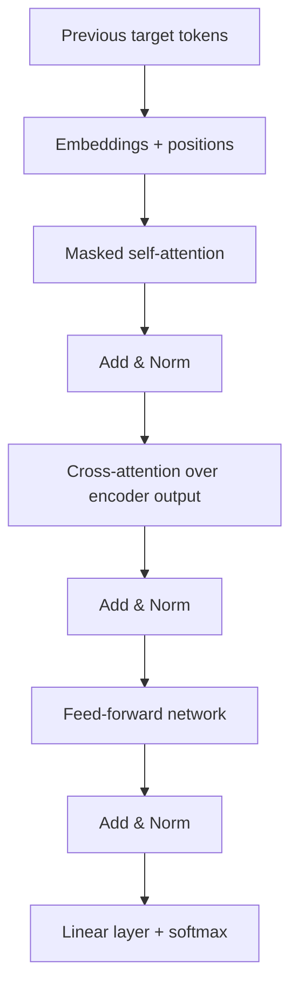

# Part 5 — The Transformer decoder and training

[← Main README](../README.md) · [← Previous](./04-transformer-encoder.md) · [Next →](./06-strengths-and-limitations.md)

---

## 13. The Transformer decoder

The decoder part contains:

1. masked self-attention;
2. encoder-decoder cross-attention;
3. a feed-forward network.



### 13.1 Shifted target input

Suppose the correct target is:

```math
[\text{I},\text{read},\text{the},\text{book},\text{EOS}]
```

The decoder input is:

```math
[\text{BOS},\text{I},\text{read},\text{the},\text{book}]
```

The desired predictions are:

| Decoder input | Target |
|---|---|
| BOS | I |
| BOS I | read |
| BOS I read | the |
| BOS I read the | book |
| BOS I read the book | EOS |

### 13.2 Masked self-attention

During training, all target tokens are stored in one tensor. However, a position must not see future answers.

A causal mask is added:

```math
M=
\begin{bmatrix}
0&-\infty&-\infty\\
0&0&-\infty\\
0&0&0
\end{bmatrix}
```

Attention becomes:

```math
\mathrm{softmax}
\left(
\frac{QK^\top}{\sqrt{d_k}}+M
\right)V
```

Because:

```math
e^{-\infty}=0
```

future positions receive zero attention probability.

For four tokens, the permitted pattern is:

```math
\begin{bmatrix}
1&0&0&0\\
1&1&0&0\\
1&1&1&0\\
1&1&1&1
\end{bmatrix}
```

This ensures that token $y_t$ depends only on:

```math
y_1,\ldots,y_{t-1}
```

### 13.3 Cross-attention

The decoder must also use the source sentence.

Let:

```math
H_{\text{enc}}
```

be the final encoder output and:

```math
H_{\text{dec}}
```

be the decoder representation.

Cross-attention uses:

```math
Q=H_{\text{dec}}W^Q
```

```math
K=H_{\text{enc}}W^K
```

```math
V=H_{\text{enc}}W^V
```

Therefore:

```math
\mathrm{CrossAttention}
=
\mathrm{Attention}
(
H_{\text{dec}}W^Q,
H_{\text{enc}}W^K,
H_{\text{enc}}W^V
)
```

The decoder asks questions about the encoded source sentence.

This is conceptually related to Bahdanau and Luong attention, but the surrounding architecture is no longer recurrent.

### Translation walkthrough

Source:

```math
[\text{من},\text{کتاب},\text{را},\text{خواندم}]
```

Target:

```math
[\text{I},\text{read},\text{the},\text{book}]
```

#### Encoder

The encoder constructs contextual representations for all source tokens.

For example:

- **خواندم** may attend to **من** to model the first-person subject;
- **کتاب** may attend to **را** to model object marking;
- **من** may attend to the verb to model its grammatical role.

#### Decoder step 1

Input:

```math
[\text{BOS}]
```

Cross-attention may focus strongly on **من**.

The output distribution assigns a high probability to:

```math
\text{I}
```

#### Decoder step 2

Input:

```math
[\text{BOS},\text{I}]
```

Masked self-attention processes the generated prefix.

Cross-attention may focus strongly on **خواندم**.

The output distribution assigns a high probability to:

```math
\text{read}
```

#### Later steps

To produce *the book*, the decoder may attend strongly to **کتاب** and **را**, while also using the already generated English prefix.

The decoder combines:

```math
\text{target history}
+
\text{source information}
```

### 13.4 Output projection

After the final decoder layer, each position has a vector:

```math
h_t\in\mathbb{R}^{d_{\text{model}}}
```

A linear layer maps it to vocabulary logits:

```math
z_t=W_{\text{vocab}}h_t+b_{\text{vocab}}
```

If the vocabulary contains $|V|$ tokens:

```math
z_t\in\mathbb{R}^{|V|}
```

Softmax converts the logits into probabilities:

```math
P(y_t=j\mid y_{<t},x)
=
\frac{\exp(z_{t,j})}
{\sum_k\exp(z_{t,k})}
```

Example logits:

```math
[2,1,0]
```

Softmax gives approximately:

```math
[0.665,0.245,0.090]
```

The first candidate token is most likely.

---

---

## 14. Training objective

For target sequence:

```math
y_1,y_2,\ldots,y_T
```

the model factorizes:

```math
P(y\mid x)
=
\prod_{t=1}^{T}
P(y_t\mid y_{<t},x)
```

Training minimizes negative log-likelihood:

```math
\mathcal{L}
=
-\sum_{t=1}^{T}
\log P(y_t\mid y_{<t},x)
```

This is equivalent to token-level cross-entropy.

### Numerical example

If the model gives the correct token probability:

```math
P(y_t)=0.7
```

then:

```math
-\log(0.7)\approx0.357
```

If it gives the correct token probability:

```math
P(y_t)=0.01
```

then:

```math
-\log(0.01)\approx4.605
```

The model is penalized much more strongly when it gives the correct token a very low probability.

---
